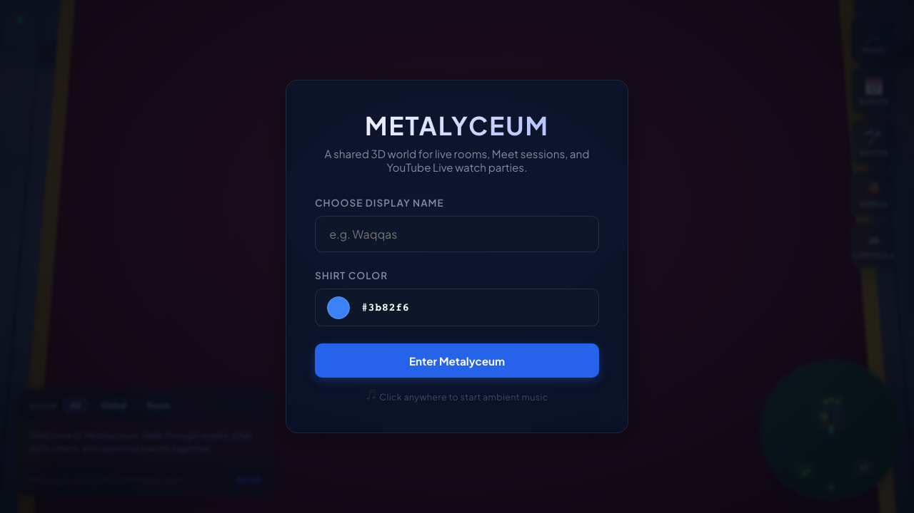
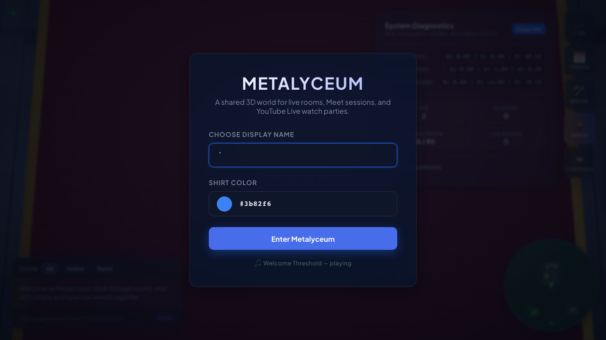
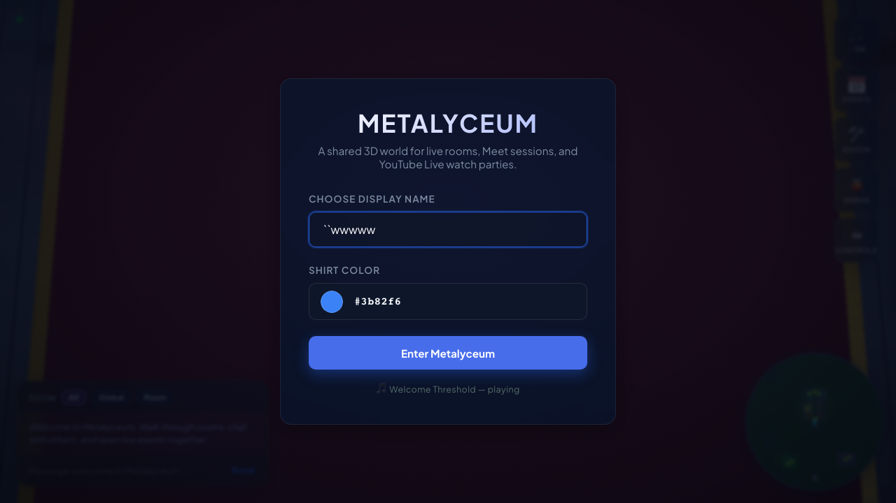
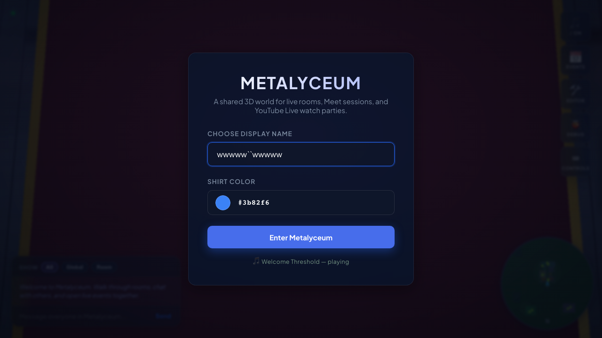

# 🌌 Metalyceum

[](https://metalyceum.app)
[](https://threejs.org/)
[](https://sqlite.org/)
[](https://vitest.dev/)

**Metalyceum** is a real-time, browser-based 3D social event world with room-specific YouTube Live streams and Google Meet collaboration sessions. Players customize their avatars, navigate a Three.js-powered open world, chat with proximity-aware or room-scoped focus, and interactively construct their surroundings using the integrated World Editor.

The entire backend infrastructure runs on a single Cloudflare Worker backed by two Durable Objects — `MetalyceumWorld` (real-time game state) and `AdminDO` (user accounts, auth, audit logs) — each with a built-in SQLite database for persistence.

---

## 🖼️ Screenshots

| Login Panel | World Overview | Building Entrance |
|:---:|:---:|:---:|
|  |  |  |

| Lobby Interior | Hallway View | Room Screen |
|:---:|:---:|:---:|
|  |  |  |

---

## 🌟 Key Features

*   **Interactive 3D World**: Custom Three.js r184 ESM rendering with a Greek museum-style main building, lobby, hallway with Doric columns, 8 interactive rooms, a second-floor mezzanine gallery, and a working elevator. Outdoor landmarks include an amphitheater, concert venue, castle, airport with runway and control tower, underground city, meandering river with waterfall and bridge, fountain plaza, and forested hills with ponds.

*   **Real-time Multiplayer**: WebSocket-based via Cloudflare Durable Objects (`MetalyceumWorld`). Implements player proximity relevance calculations, location-scoped chat, network profile adjustment (8–50 Hz position updates), and graceful reconnection with a 15-second grace window.

*   **12 Virtual Rooms & Event Streams**: North Hall, East Studio, Open Workshop, Broadcast Room, South Lounge, Crit Room, Screening Room, Commons, Outdoor Amphitheater, Concert Venue, Upper Gallery (second floor), and Underground City. Each room supports embedded YouTube Live or Google Meet sessions with a dedicated room-sidebar panel and theater mode.

*   **NPC Characters**: 12 wandering NPCs populate the world — Alex, Riley, and Quinn in indoor rooms; Jay, River, and Parker in the lobby; Ember and Vale at the amphitheater; Lyric and Echo at the concert venue. NPCs walk randomly, display emoji thought-bubbles during idle moments, and avoid collision with walls.

*   **Animated Fountain & Environment**: A multi-tiered fountain with vertex-displaced water surfaces, rising bubbles, cascade streams, ripple rings, a glowing water apple, and orbiting fish. A meandering river with custom-shader water and waterfall completes the outdoor scene.

*   **Elevator**: A fully functional elevator at the north end of the lobby with swinging mahogany doors, brass trim, marble floor, crown molding, chandelier, and gold pediment. Rides between ground floor and mezzanine with smooth camera transitions and second-floor environment fade.

*   **Collaborative World Editor**: Admin-locked in-world layout editor using Three.js `TransformControls` for placing, moving, scaling, rotating, duplicating, and deleting custom meshes in real-time. Changes persist via WebSocket to SQLite.

*   **Comprehensive Fade System**: A zone-based opacity transition system handles smooth indoor/outdoor lighting blends, roof/wall fade when entering buildings, mezzanine floor fade during elevator rides, and ground-floor object dimming when viewing from above.

*   **SQLite Persistence**: Durable Object SQLite stores world asset placements, room event metadata, chat history (last 100 messages), and internal configuration versions.

*   **MIDI Soundtrack Board**: Integrated client-side MIDI synthesizer with 10 ambient soundtracks, play/pause/skip controls, and per-track instrument volume mixing.

*   **Performance Optimized**: Shadow map 1024², reduced pixel ratio, Cineon tone mapping, disabled MSAA, linear fog, Cannon physics throttled to 30fps, NPC distance culling, throttled torch flicker and vertex animations, scene root count minimized.

---

## 🛠️ Technology Stack

| Component | Technology | Description / Usage |
| :--- | :--- | :--- |
| **Server Runtime** | **Cloudflare Workers** | Scalable serverless edge handler. |
| **Real-time State** | **Durable Objects** | `MetalyceumWorld` (game state, WebSockets) + `AdminDO` (auth, audit). |
| **Database** | **DO SQLite** | Durable storage for assets, chat, rooms, and config (`ctx.storage.sql`). |
| **Client Core** | **Vanilla ES6 JavaScript** | Module-based architecture with coordinator pattern. |
| **3D Engine** | **Three.js (r184)** | ESM import map, scene graph, WebGL renderer, OrbitControls, TransformControls. |
| **Type Check** | **TypeScript** | Static typing for server code and shared contracts (client is plain JS). |
| **Physics Proxy** | **cannon-es** | XZ-only wall and asset collision; terrain-follow and jump remain manual. |
| **Test Runners** | **Vitest + Playwright** | 111 unit/client tests + browser/e2e tests with Playwright. |

---

## 📁 Repository Layout

```
├── src/                          # Server / Worker code (TypeScript)
│   ├── index.ts                  # Worker entry — routing, CORS, security headers
│   ├── durable_object.ts         # MetalyceumWorld Durable Object
│   ├── validation.ts             # Pure input sanitization (testable outside Workers)
│   ├── realtime.ts               # Proximity relevance & chat scoping
│   ├── session_source.ts         # Request origin classification
│   ├── constants.ts              # Limits, types, default rooms
│   ├── admin/                    # AdminDO + schemas + pagination
│   ├── http/                     # Request ID, JSON parsing, error envelopes
│   └── internal/                 # Cross-DO communication contracts
│
├── public/                       # Client SPA (static assets)
│   ├── index.html                # HTML shell, CSP, import map
│   ├── styles.css                # Glassmorphic styling, HUD overlays
│   ├── app.js                    # Application boot coordinator
│   ├── _headers                  # Edge security headers (static assets)
│   ├── js/
│   │   ├── engine.js             # Render loop, camera, fog, shadow, fade zones
│   │   ├── engine/
│   │   │   ├── movement.js       # Local player kinematics, collision, jetpack
│   │   │   └── camera.js         # Orbit controls, exit watch, auto-align
│   │   ├── building.js           # Main building geometry (~825 lines, 8 sections)
│   │   ├── building/
│   │   │   ├── roof.js           # Gabled terracotta roof with pediments
│   │   │   ├── doors.js          # Door frame geometry
│   │   │   ├── torches.js        # Wall torch geometry + lights
│   │   │   └── interiors.js      # Classroom furniture sets
│   │   ├── scenery.js            # Barrel file for all scenery modules
│   │   ├── scenery/
│   │   │   ├── plaza.js          # Fountain plaza, room indicators, banners
│   │   │   ├── amphitheater.js   # Open-air amphitheater with stage
│   │   │   ├── concert-venue.js  # Concert hall with dome + giant screen
│   │   │   ├── castle.js         # Medieval castle with towers + dungeon
│   │   │   ├── airport.js        # Runway, control tower, hangar, helipad
│   │   │   ├── underground-city.js # Cave entrance + subterranean city
│   │   │   ├── river.js          # Meandering river with waterfall + bridge
│   │   │   ├── roads.js          # Terrain-following roads + bridge
│   │   │   ├── foliage.js        # Bushes, ornamental trees, flower clusters
│   │   │   ├── world-details.js  # Trees, ponds, wildflowers, grass patches
│   │   │   ├── assets.js         # Shared geometries, sprites, boulders
│   │   │   ├── utils.js          # Terrain deformation, floor helper
│   │   │   └── visibility.js     # Frustum/distance culling
│   │   ├── fade-system.js        # Zone-based opacity transition system
│   │   ├── multiplayer.js        # WebSocket connection, reconnection
│   │   ├── physics.js            # Terrain height, collision, room lookup
│   │   ├── physics-engine.js     # Cannon-es XZ collision proxy
│   │   ├── characters.js         # Player/NPC avatars, animation
│   │   ├── audio.js              # MIDI soundtrack synth
│   │   ├── chat.js               # Chat log, bubbles, scope
│   │   ├── room-panel.js         # Room sidebar coordinator
│   │   ├── room-panel/
│   │   │   ├── event-board.js    # Room status board
│   │   │   ├── media.js          # YouTube/Meet iframe sync
│   │   │   └── player-list.js    # Room player avatars
│   │   ├── room-animation.js     # Fountain, water, indicator animations
│   │   ├── editor.js             # World editor (TransformControls)
│   │   ├── dev-tools.js          # Runtime inspection, audit, debug
│   │   ├── minimap.js            # 2D overhead minimap
│   │   ├── theater.js            # Fullscreen media overlay
│   │   ├── textures.js           # Procedural canvas textures
│   │   ├── lighting.js           # Torch flicker updates
│   │   ├── environment.js        # HDRI environment loader
│   │   ├── config.js             # Client configuration constants
│   │   ├── state.js              # Shared mutable state
│   │   ├── math.js               # Math utilities (HALF_PI, FLAT, lerp)
│   │   ├── utils.js              # Shared helpers
│   │   ├── ui.js                 # HUD panels coordinator
│   │   └── ui/
│   │       ├── debug-panel.js    # FPS, position, scene stats
│   │       ├── elevator.js       # Elevator state machine + UI
│   │       ├── login.js          # Login form, avatar color picker
│   │       └── soundtrack-panel.js # Music player UI
│   │
│   └── midi/                     # MIDI soundtracks (8 instrument tracks)
│
├── test/                         # Tests
│   ├── client/                   # Client unit/integration tests
│   │   ├── physics.test.ts
│   │   ├── dev-tools.test.ts
│   │   ├── cannon-integration.test.ts
│   │   └── engine.browser.test.ts  # Browser + WebGL perf budget
│   └── ...
│
├── screenshots/                  # README screenshots
├── wrangler.jsonc                # Cloudflare Workers config
├── tsconfig.json                 # TypeScript config
├── vitest.config.ts              # Vitest config
└── package.json                  # Dependencies + scripts
```

### World Landmarks (5)

| Landmark | Coordinates | Radius | File |
|----------|-------------|--------|------|
| 🏰 Castle | (130, -80) | 40 | `scenery/castle.js` |
| 🛩️ Airport | (160, 220) | 50 | `scenery/airport.js` |
| 🏛️ Amphitheater | (65, 150) | 22 | `scenery/amphitheater.js` |
| 🎵 Concert Venue | (-85, 140) | 23 | `scenery/concert-venue.js` |
| 🕳️ Underground City | (120, 80) | 20 | `scenery/underground-city.js` |

### Interactive Rooms (12)

| ID | Name | Floor | Type | Location |
|:--:|------|:-----:|------|----------|
| 0 | North Hall | Ground | Room | West wing |
| 1 | East Studio | Ground | Room | West wing |
| 2 | Open Workshop | Ground | Room | West wing |
| 3 | Broadcast Room | Ground | Room | West wing |
| 4 | South Lounge | Ground | Room | East wing |
| 5 | Crit Room | Ground | Room | East wing |
| 6 | Screening Room | Ground | Room | East wing |
| 7 | Commons | Ground | Room | East wing |
| 8 | Outdoor Amphitheater | Ground | Venue | Northeast |
| 9 | Concert Venue | Ground | Venue | Northwest |
| 10 | Upper Gallery | Second | Room | East wing (mezzanine) |
| 12 | Underground City | Subterranean | Venue | Southeast |

---

## 💾 SQLite Database Schema

Inside `MetalyceumWorld`, Durable Object SQLite stores the following tables:

### `room_events`
```sql
CREATE TABLE IF NOT EXISTS room_events (
  room_id INTEGER PRIMARY KEY,
  name TEXT NOT NULL,
  source_value TEXT NOT NULL,
  start_time TEXT,
  duration_minutes INTEGER NOT NULL DEFAULT 0,
  updated_at INTEGER NOT NULL DEFAULT 0
)
```

### `world_assets`
```sql
CREATE TABLE IF NOT EXISTS world_assets (
  id TEXT PRIMARY KEY,
  asset_type TEXT NOT NULL,
  x REAL NOT NULL,
  y REAL NOT NULL,
  z REAL NOT NULL,
  rotation_y REAL NOT NULL,
  scale REAL NOT NULL,
  room_id INTEGER NOT NULL
)
```

### `chat_messages`
```sql
CREATE TABLE IF NOT EXISTS chat_messages (
  id INTEGER PRIMARY KEY AUTOINCREMENT,
  sender_id TEXT NOT NULL,
  username TEXT NOT NULL,
  color TEXT NOT NULL,
  message TEXT NOT NULL,
  scope TEXT NOT NULL,
  room_id INTEGER,
  created_at INTEGER NOT NULL
)
```

### `meta`
```sql
CREATE TABLE IF NOT EXISTS meta (
  key TEXT PRIMARY KEY, 
  value TEXT NOT NULL
)
```

---

## 🚀 Running & Developing Locally

### 1. Installation
```bash
npm install
npx playwright install chromium   # for e2e tests
```

### 2. Start Local Server
```bash
npm run dev
```
Open [http://localhost:8787](http://localhost:8787) in your browser. Enter a username, pick an avatar color, and click **Join** to explore.

### 3. Run Tests
```bash
npm run test          # 111 unit + client tests
npm run test:e2e      # Playwright browser/e2e tests
```

### 4. Type Check
```bash
npm run typecheck           # Worker TypeScript
npm run typecheck:test      # Test TypeScript
```

### 5. Deploy to Cloudflare
```bash
npm run deploy
```

---

## 🎮 Controls

| Key | Action |
|:---:|--------|
| **W/A/S/D** | Walk forward/left/backward/right |
| **Space** | Jump |
| **Shift** | Sprint (ground) / descend (flight) |
| **T** | Toggle jetpack takeoff |
| **Y** | Toggle jetpack landing |
| **Arrow Keys** | Orbit camera |
| **Backtick (`)** | Toggle debug panel |
| **Click on screen** | Open room media / interact |
| **E** | Open elevator panel (near elevator) |

---

## 🔒 Configuration

### World Editor Authorization
World modification tools require a valid `WORLD_EDITOR_TOKEN` in the Worker bindings. Set `ADMIN_INIT_TOKEN` to bootstrap the initial admin owner account via `POST /api/v1/auth/init`.

### Static Resource Caching
Custom cache and security headers for static assets are configured in [`public/_headers`](public/_headers) — applied at the edge without invoking the Worker.

### Security Headers
Worker responses include `X-Content-Type-Options: nosniff`, `Referrer-Policy: strict-origin-when-cross-origin`, and `X-Frame-Options: DENY` via [`src/index.ts`](src/index.ts). CSP is delivered via `<meta>` tag in `index.html`.

---

## 📚 Further Reading

- **[CLAUDE.md](CLAUDE.md)** — Development guidelines, architecture details, and LLM dev tool documentation
- **[REASONIX.md](REASONIX.md)** — Tech stack constraints, conventions, and project context
- **[docs/scenery-physics-lighting-comparison.md](docs/scenery-physics-lighting-comparison.md)** — Historical comparison of 3D, physics, and lighting changes
